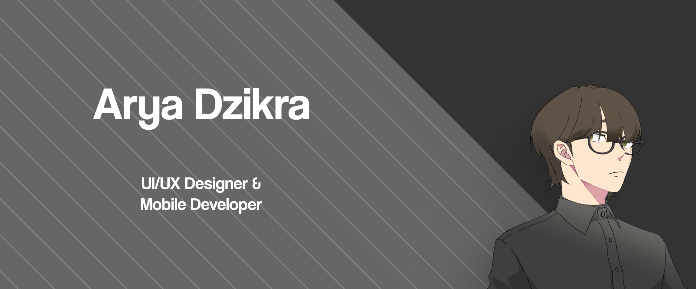

# Hi, I'm Arya
I'm interested in Web & Mobile Programming and Application Design. Trying to always learn something new and being discipline.

# 🧠 Softskill:
- 🤔 Problem Solving B+
- 🇬🇧  English A-
- 📊 Analysis A
- 🖌️ Graphic Design A-

#

# 🛠️ Languages I Used:
- 🌐 HTML
- 🎨 CSS
- ☕ Java
- 🤖 Kotlin
- 🧱 XML
- 🗿 PHP

#

# 💻 My Device
Currently I'm using Windows as my platform for developing programs. I've been using Acer Aspire 5 A515-45 as my daily driver.
- 🪟 Windows

# 🖼️ My Portfolio:
Wanna see my Design Portfolio?  
🔗 <a href="https://www.behance.net/aryadzikra)">Click this link!</a>

#

# 🌐 My Socials:
   

# 📊 My Stats:
 

# 🏆 My Trophies

